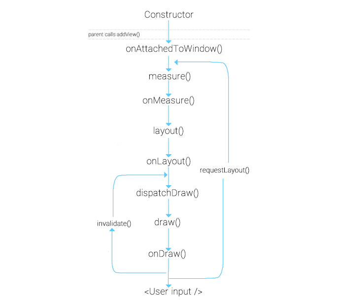

# View의 LifeCycle

안드로이드에서 View의 라이프사이클은 뷰가 생성되고, 화면에 나타나며, 상호작용하고, 사라지기까지의 과정을 포함합니다.

이 과정은 여러 콜백 메소드들을 통해 관리되며, 각 메소드는 뷰의 특정 상태 또는 단계에 대응합니다

## 시작하기

- **onAttachedToWindow()**  
  View가 window에 연결될 때 호출되며, 뷰가 화면에 표시될 준비가 되었음을 알린다.  
  View 초기화 작업을 수행하는 데 사용할 수 있다.  
  addView() 함수를 호출하여 View를 View 그룹에 추가할 때 호출한다.

 

## 측정하기

- **measure() / onMeasure()**  
  이 단계에서 뷰의 크기가 결정된다.  
  measure() 메소드는 시스템에 의해 호출되며 실제 크기 계산은 onMeasure()에서 수행된다.  
  개발자는 뷰의 크기를 MeasureSpec 제약 조건 내에서 결정해야 한다.  
  onMeasure() 메소드를 오버라이드하여 자식 View의 크기를 고려하여 View의 크기를 지정할 수 있다.

 

## 배치하기

- **layout() / onLayout()**  
  View의 위치가 부모 내에서 결정된다.  
  layout() 메소든느 뷰의 위치를 설정하고, onLayout()을 통해 위치 설정 로직을 구현한다.  
  onLayout() 메소드를 오버라이드하여 자식 View의 위치를 지정할 수 있다.  
   onLayout() 메소드는 ViewGroup에 대해 자식 뷰의 정확한 위치를 배치하는데 사용된다.

 

## 그리기

- **draw() / onDraw()**  
  뷰의 그리기 작업이 수행된다.  
  draw() 메소드는 뷰의 배경, 자신의 내용, 자식 뷰들 , 그리고 전경을 그린다.  
  onDraw() 메소드는 개발자가 커스텀 뷰를 그리기 위해 오버라이드 할 수 있으며, 뷰의 실제 내용을 그린다.

 

- **dispatchDraw()**  
  ViewGroup에 정의되어 있으며, ViewGroup에서 자식 뷰들의 그리기를 관리한다.  
  하위 뷰를 그리기 위해 draw()에 의해 호출되며 현재 View와 그 안에 포함된 모든 자식 View를 그린다. onDraw() 메소드가 끝난 후에 호출되며 오버라이드하여 뷰 그리기 순서를 제어하거나 드로잉 이벤트를 처리한다.

 

draw() 메소드는 뷰의 전체적인 그리기 프로세스를 관리하며, 이 과정에서 onDraw()를 사용해 뷰의 주요 내용을 그리고, dispatchDraw()를 사용해 ViewGroup의 경우 자식 뷰들을 순차적으로 그리는 것이다.

 

## 무효화

- **invalidate()**  
  View 클래스에 정의된 메소드로써, 호출될 때 현재 뷰를 무효화한다.  
  뷰의 현재 상태가 더 이상 유효하지 않으며 다시 그려져야 함을 알리는 신호로 작용한다.  
  뷰의 상태가 변경되어 그 내용이 더 이상 유효하지 않고 화면에 다시 그려져야 할 때 발생한다. 
  이후 다시 draw() 메소드가 호출되며 변경 사항을 다시 그린다.

 

## 다시 계산하기

- **requestLayout()**  
  View 또는 ViewGroup의 레이아웃이 변경될 필요가 있음을 시스템에 알리는 데 사용된다.  
  이 메소드가 호출되면 시스템은 해당 뷰의 measure 및 layout 과정을 다시 수행하도록 한다.

 

뷰나 뷰 그룹의 크기나 위치 등의 레이아웃 파라미터가 변경될 때 호출된다.  
이때 뷰 트리 내에서 해당 뷰와 그 부모 뷰들을 통해 새로운 레이아웃 계산을 시작한다.

 

## 결과

<image src="images/Animation.gif">
